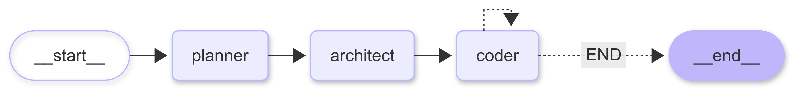

# 🛠️ Coder Buddy

**Coder Buddy** is an AI-powered coding assistant built with [LangGraph](https://github.com/langchain-ai/langgraph).  
It works like a multi-agent development team that can take a natural language request and transform it into a complete, working project — file by file — using real developer workflows.

---

## 🏗️ Architecture

- **Planner Agent** – Analyzes your request and generates a detailed project plan.
- **Architect Agent** – Breaks down the plan into specific engineering tasks with explicit context for each file.
- **Coder Agent** – Implements each task, writes directly into files, and uses available tools like a real developer.

    

---
